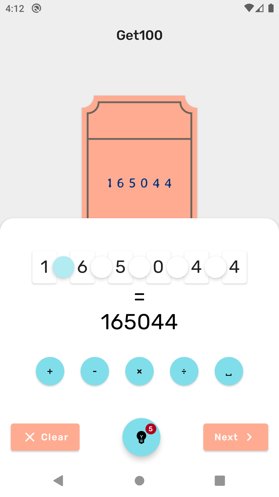
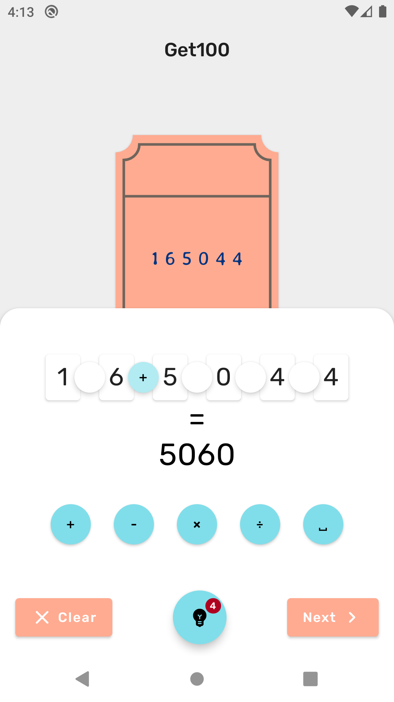
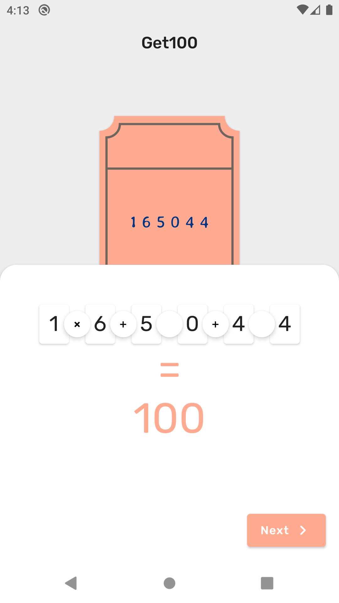
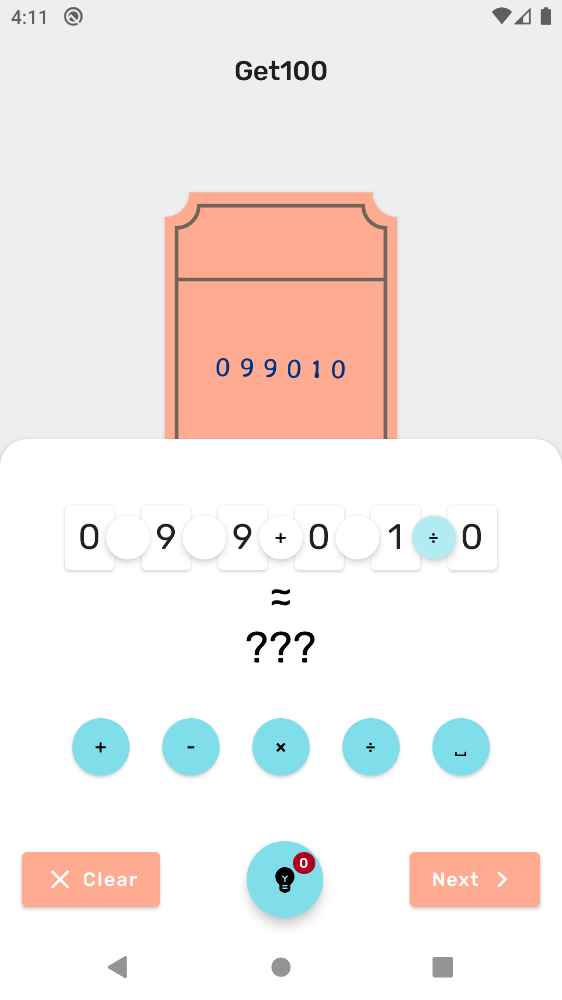

# Get100 - an Android arithmetic puzzle game
[](https://play.google.com/store/apps/details?id=cdu145.tickets)

   

Get100 is an arithmetic puzzle game for Android.
The task is to place the signs of arithmetic operations between the numbers so that you get 100.
The game interface instantly reacts to changes you make to the solution, updating shown result.
Get100 is a great way to practice calculating in your head.

## Building & Installation
You can [import](https://developer.android.com/studio/intro/migrate#import_a_gradle-based_intellij_project) project
in Android Studio and use ```Build``` > ```Generate Signed Bundle / APK...``` wizard to build APK.
Alternatively, you can build APK using [command line tools](https://developer.android.com/studio#downloads):
1. Download the source code
```
$ git clone https://github.com/cdu145/get100.git
$ cd get100
```

2. Create ```keystore.properties``` file containing [APK signing](https://developer.android.com/studio/publish/app-signing) credentials:
```
storeFile=/path/to/keystore/file.jks
storePassword=***
keyAlias=<used-key-alias>
keyPassword=***
```

3. Start building
```
$ export ANDROID_SDK_ROOT=/path/to/android-sdk
$ ./gradlew assembleRelease
```

Install APK using [ADB](https://developer.android.com/studio/command-line/adb):
```
$ adb install app/build/outputs/apk/release/app-release.apk
```
or manually on device.
